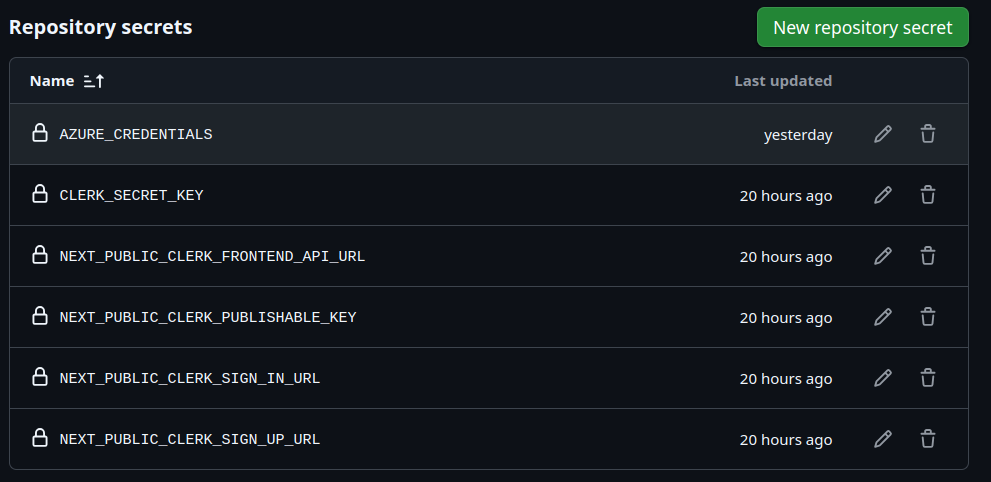
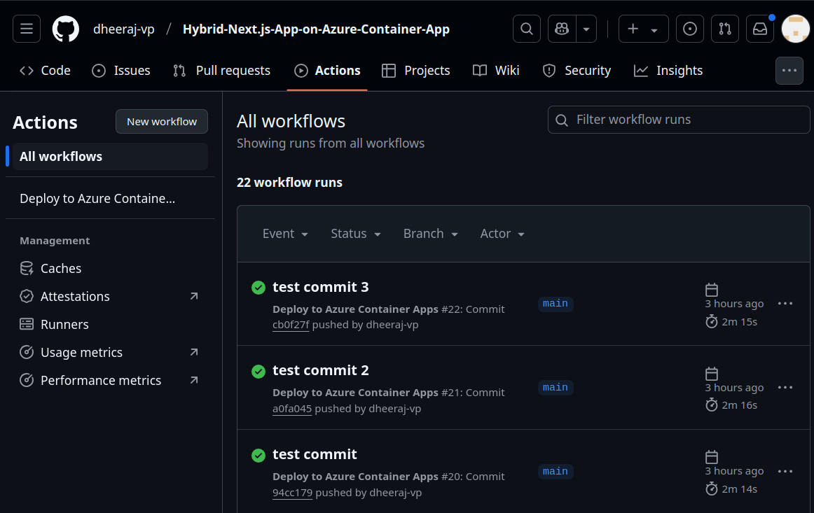
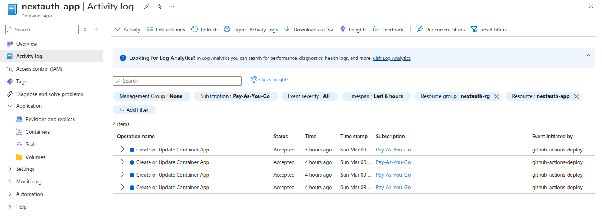

# Deploying a Hybrid Next.js App on Azure Container Apps

### Create `.env.local` File  

The `.env.local` file stores sensitive environment variables needed for authentication and application configuration. Ensure this file is **not committed** to Git by adding it to `.gitignore`.  

```bash
NEXT_PUBLIC_CLERK_PUBLISHABLE_KEY=pk_live_YOUR_PUBLISHABLE_KEY
CLERK_SECRET_KEY=sk_live_YOUR_SECRET_KEY
NEXT_PUBLIC_CLERK_SIGN_IN_URL=/sign-in
NEXT_PUBLIC_CLERK_SIGN_UP_URL=/sign-up
NEXT_PUBLIC_CLERK_FRONTEND_API_URL=https://clerk.staging.calquity.com
```

### Dockerfile
The Dockerfile defines how the Next.js application will be containerized.


## 🚀 Step 1: Log in to Azure & Set Variables

### 1.1 Log in to Azure CLI
This command will open a browser for authentication. Once logged in, return to the terminal.
```bash
az login
```

### 1.2 Set Environment Variables
Replace `<unique-name>` with a unique identifier (e.g., your initials + date).
```bash
RESOURCE_GROUP="nextauth-rg"
LOCATION="eastus"
ACR_NAME="nextauthacr<unique-name>"
CONTAINER_APP_NAME="nextauth-app"
IMAGE_NAME="nextauth-image"
```

---

## 🔹 Step 2: Create Azure Container Registry (ACR)

### 2.1 Create a Resource Group
```bash
az group create --name $RESOURCE_GROUP --location $LOCATION
```

### 2.2 Create Azure Container Registry (ACR)
```bash
az acr create --resource-group $RESOURCE_GROUP --name $ACR_NAME --sku Basic --admin-enabled true
```

### 2.3 Log in to ACR
```bash
az acr login --name $ACR_NAME
```

---

## 🔹 Step 3: Push Docker Image to ACR

### 3.1 Get ACR Login Server
```bash
ACR_LOGIN_SERVER=$(az acr show --name $ACR_NAME --query "loginServer" --output tsv)
```

### 3.2 Build & Tag the Docker Image for ACR
Make sure your Docker image is built before tagging.
```bash
docker build -t my-nextjs-app .
docker tag my-nextjs-app $ACR_LOGIN_SERVER/$IMAGE_NAME:v1
```

### 3.3 Push the Image to ACR
```bash
docker push $ACR_LOGIN_SERVER/$IMAGE_NAME:v1
```

---

## 🔹 Step 4: Deploy to Azure Container Apps (ACA)

### 4.1 Register ACA if Not Done Before
```bash
az provider register --namespace Microsoft.App
```

### 4.2 Enable ACA Extensions
```bash
az extension add --name containerapp --upgrade
```

### 4.3 Create an Azure Container App Environment
```bash
az containerapp env create --name nextauth-env --resource-group $RESOURCE_GROUP --location $LOCATION
```

### 4.4 Deploy the App to ACA
Replace the respective keys here and then run the command.
```bash
az containerapp create \
    --name $CONTAINER_APP_NAME \
    --resource-group $RESOURCE_GROUP \
    --environment nextauth-env \
    --image $ACR_LOGIN_SERVER/$IMAGE_NAME:v1 \
    --registry-server $ACR_LOGIN_SERVER \
    --registry-username $(az acr credential show --name $ACR_NAME --query "username" --output tsv) \
    --registry-password $(az acr credential show --name $ACR_NAME --query "passwords[0].value" --output tsv) \
    --cpu 0.5 --memory 1Gi \
    --ingress external --target-port 3000 \
    --env-vars NEXT_PUBLIC_CLERK_PUBLISHABLE_KEY="your-pk" \
               CLERK_SECRET_KEY="your-sk" \
               NEXT_PUBLIC_CLERK_SIGN_IN_URL="/sign-in" \
               NEXT_PUBLIC_CLERK_SIGN_UP_URL="/sign-up" \
               NEXT_PUBLIC_CLERK_FRONTEND_API_URL="https://clerk.my-app.eastus.azurecontainerapps.io"
```

---

## 🔹 Step 5: Get Your App's URL
Retrieve the live URL of your deployed application.
```bash
az containerapp show --name $CONTAINER_APP_NAME --resource-group $RESOURCE_GROUP --query "properties.configuration.ingress.fqdn" --output tsv
```
**Example Output:**
```
https://nextauth-app.somehash.region.azurecontainerapps.io
```

---

## 🔹 Step 6: Verify the Deployment
Open the URL in your browser.
- If you see your Next.js app running, the deployment is successful.
- If you get a **502 error**, wait a few minutes or check the logs.

---

## 🔹 Step 7: Check Logs (If Issues Occur)
If the deployment fails, use this command to check logs:
```bash
az containerapp logs show --name $CONTAINER_APP_NAME --resource-group $RESOURCE_GROUP --follow
```

---
## **Current Status**
- The Next.js app has been **successfully deployed** on **Azure Container Apps**.
- The deployed application is accessible at:  
```
https://nextauth-app.somehash.region.azurecontainerapps.io
```
- Clerk authentication **requires a verified custom domain**, but currently, the app is running on Azure’s default domain (`*.azurecontainerapps.io`), which **cannot be configured with Clerk**.


# Steps to Add a Custom Domain in Azure Container Apps

## 1. Add Custom Domain in Azure Portal

### 1️⃣ Go to Azure Portal
- Open the [Azure Portal](https://portal.azure.com).
- Navigate to **Azure Container Apps**.
- Select your container app (`nextauth-app`).

### 2️⃣ Go to "Custom Domains"
- In the left menu, click **Custom Domains**.
- Click **Add Custom Domain**.

### 3️⃣ Enter Your Domain Name
- Add `staging.calquity.com`.


---

## 2. Update DNS Records
 Azure will provide CNAME and TXT records. Add these to your DNS provider (e.g., Cloudflare, Azure DNS).

### ✅ Add DNS Records
**TXT Record (Domain Verification)**

**CNAME Record (Point to Azure)**

## Important
- **If using Cloudflare**: Disable proxy mode (set to **DNS-only**).
- **For Azure DNS**: Update records in the respective DNS zone.

---

## 3. Verify and Save in Azure
1. Click **Validate** in Azure.
2. Once validated, click **Add Domain**.
3. Azure will automatically issue an SSL certificate.

---

## Update Clerk Allowed Domains
1. Go to the [Clerk Dashboard](https://dashboard.clerk.com/).
2. Navigate to **Domains**.
3. Add `staging.calquity.com` as an allowed domain.
4. Remove any old/invalid domains.

---

## Final Checks
✅ Test the app at:  
`https://staging.calquity.com`.  

✅ Verify DNS resolution with:  
```sh
nslookup staging.calquity.com


# 🚀 Continuous Integration and Deployment with GitHub Actions & Azure

This guide walks you through setting up **GitHub Actions** for continuous integration and deployment (CI/CD). The deployment is triggered on every **commit or pull request to the `main` branch**.

---

## 🔹 Configuring Deployment Variables in GitHub Actions

To ensure the deployment works correctly, you need to configure environment variables in the **GitHub Actions workflow file** (`deploy.yml`).

### 1️⃣ Update Environment Variables in `deploy.yml`

Open the `deploy.yml` file inside the `.github/workflows/` directory and update the following values based on your **Azure setup**:

```yaml
env:
  IMAGE_NAME: nextauth-image  # Replace with your container image name
  ACR_NAME: nextauthacrnamev2  # Replace with your Azure Container Registry (ACR) name
  RESOURCE_GROUP: nextauth-rg  # Replace with your Azure Resource Group name
  CONTAINER_APP_NAME: nextauth-app  # Replace with your Azure Container App name
```

---

## 🔹 Setting Up GitHub Secrets for Deployment

To ensure secure and automated deployment, you need to add your environment variables as GitHub secrets.

### 1️⃣ Add Azure Credentials to GitHub Secrets

The Azure Service Principal credentials are required for GitHub Actions to authenticate with Azure.

#### 🛠 Steps to Generate Credentials

Run the following command in your terminal:

```sh
az ad sp create-for-rbac --name "github-actions-deploy" --role contributor \
    --scopes /subscriptions/$(az account show --query id -o tsv)/resourceGroups/nextauth-rg --sdk-auth
```

This will return a JSON output like this:

```json
{
  "clientId": "xxxxxxxx-xxxx-xxxx-xxxx-xxxxxxxxxxxx",
  "clientSecret": "xxxxxxxxxxxxxxxxxxxxxxxxxxxxxxxx",
  "subscriptionId": "xxxxxxxx-xxxx-xxxx-xxxx-xxxxxxxxxxxx",
  "tenantId": "xxxxxxxx-xxxx-xxxx-xxxx-xxxxxxxxxxxx",
  "activeDirectoryEndpointUrl": "https://login.microsoftonline.com",
  "resourceManagerEndpointUrl": "https://management.azure.com/",
  "activeDirectoryGraphResourceId": "https://graph.windows.net/",
  "sqlManagementEndpointUrl": "https://management.core.windows.net:8443/",
  "galleryEndpointUrl": "https://gallery.azure.com/",
  "managementEndpointUrl": "https://management.core.windows.net/"
}
```

#### 🔹 Add to GitHub Secrets

1. Go to **GitHub Repository → Settings → Secrets and Variables → Actions**.
2. Click **New Repository Secret**.
3. Name the secret **AZURE_CREDENTIALS**.
4. Copy the entire JSON output and paste it as the value.
5. Click **Save**.

📌 **Example of Repository Secrets Added:**


### 2️⃣ Add Environment Variables as GitHub Secrets

Your Next.js application requires several environment variables for authentication. Add the following:

#### 🔹 Steps to Add Each Secret

1. Go to **GitHub Repository → Settings → Secrets and Variables → Actions**.
2. Click **New Repository Secret**.
3. Enter the name (e.g., `NEXT_PUBLIC_CLERK_PUBLISHABLE_KEY`).
4. Enter the corresponding value.
5. Click **Save**.
6. Repeat this for each of the environment variables:

```yaml
NEXT_PUBLIC_CLERK_PUBLISHABLE_KEY=your_publishable_key
CLERK_SECRET_KEY=your_secret_key
NEXT_PUBLIC_CLERK_SIGN_IN_URL=/sign-in
NEXT_PUBLIC_CLERK_SIGN_UP_URL=/sign-up
NEXT_PUBLIC_CLERK_FRONTEND_API_URL=https://your-clerk-api-url
```

---

## ✅ Verifying Deployment Workflow

Once the setup is complete, push a commit to the main branch to trigger the workflow.

### 🔹 Check GitHub Actions Workflow Execution:

1. Navigate to **GitHub Repository → Actions**.
2. Click on the latest workflow run.
3. Check the logs for any errors or failures.
4. If deployment fails, use **GitHub Actions logs** and **Azure Container Apps logs** for troubleshooting.

📌 **Example of a Successful Workflow Run:**


---

## 🔧 Debugging Common Issues

| Issue | Possible Solution |
|-------|------------------|
| ❌ Docker Build Fails | Ensure `Dockerfile` exists and syntax is correct. Run `docker build .` locally to debug. |
| ❌ Azure Authentication Failure | Ensure `AZURE_CREDENTIALS` is correctly set in GitHub Secrets and is valid. |
| ❌ Environment Variables Not Loaded | Confirm they are correctly set in `deploy.yml` and GitHub Secrets. |
| ❌ Container App Not Updating | Try forcing a new deployment with a different tag or re-running the workflow. |

📌 **Example of Azure Container Apps Activity Log:**


---

## 🎯 Summary of Deployment Workflow

1️⃣ **Push code to main** → GitHub Actions triggers the workflow  
2️⃣ **Build and push Docker image** to Azure Container Registry (ACR)  
3️⃣ **Deploy new container image** to Azure Container Apps  
4️⃣ **Verify deployment** via GitHub Actions logs and Azure Portal  

---

## 📚 Reference Links

- [GitHub Actions Documentation](https://docs.github.com/en/actions)
- [Azure Container Apps Docs](https://learn.microsoft.com/en-us/azure/container-apps/)
- [Docker Best Practices](https://docs.docker.com/develop/dev-best-practices/)

